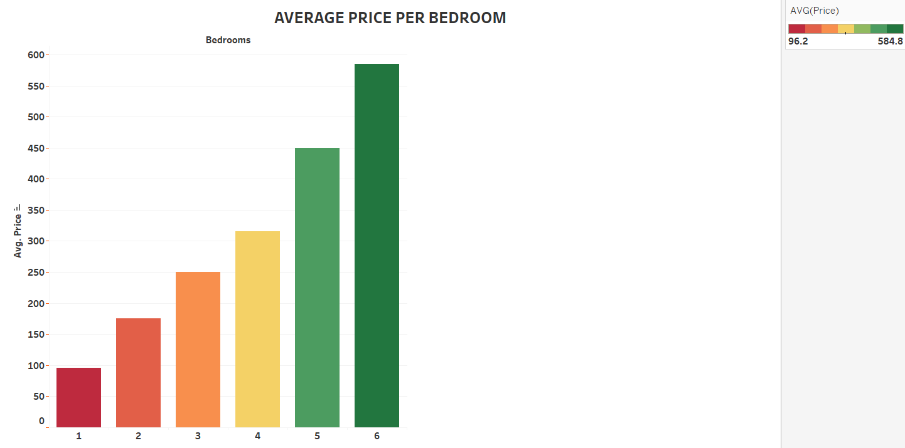

## **Tableau Project: Airbnb Price & Revenue Dashboard - Project Overview**

The **Airbnb Price & Revenue Dashboard** leverages detailed data from Airbnb listings in Seattle to provide comprehensive insights into pricing trends, seasonal revenue fluctuations, and how the number of bedrooms in a property affects its pricing. This dashboard is designed to help both Airbnb hosts and guests make informed decisions, optimize pricing strategies, and understand the broader market dynamics of the Seattle Airbnb ecosystem.

You can view the interactive version of the dashboard here:  
[Tableau Public Dashboard - Airbnb Price & Revenue Analysis](https://public.tableau.com/views/AirbnbPriceRevenueDashboard_17321417877660/Dashboard1?:language=en-US&:sid=&:redirect=auth&:display_count=n&:origin=viz_share_link)

---

### **Key Steps and Visualizations**

#### **1. Average Price by Zipcode (Bar Graph)**
This bar graph represents the average price of Airbnb listings across various zip codes in Seattle. It allows users to quickly compare the cost of listings in different neighborhoods and make sense of regional pricing trends. This insight is valuable for:
- Hosts: Helping them adjust their pricing based on the average price in their neighborhood.
- Guests: Identifying areas that offer the best value for money.

#### **2. Price by Zipcode (Map of Seattle)**
This map visualizes the average price of Airbnb listings by zip code in Seattle, with bubbles sized according to price levels. The map provides a spatial representation of where higher and lower prices are located, giving users a geographical sense of which neighborhoods are more expensive. This visualization can help hosts adjust their pricing based on geographic trends or help guests select locations based on price preferences.

- **Insights for Hosts**: Hosts can use this map to see how their prices compare to listings in the same neighborhood or across Seattle.
- **Insights for Guests**: Guests can quickly identify affordable neighborhoods or pinpoint luxury listings in prime areas.

#### **3. Revenue for Year 2016 Week Wise**
This line graph shows the revenue generated by Airbnb listings each week during the year 2016. This visualization highlights peak revenue periods, allowing hosts to identify the most profitable times of the year based on actual sales data. By understanding seasonal trends, hosts can adjust their pricing strategies to maximize profits during high-demand weeks (e.g., holidays, special events).

- **Insights for Hosts**: Helps predict the best weeks to list properties and set dynamic pricing for peak periods.
- **Insights for Guests**: Guests can see when the market is most expensive, giving them the option to book during off-peak times for better deals.

#### **4. Average Price by Bedroom Range (0-6 Bedrooms)**
This visualization shows the average price for Airbnb listings categorized by the number of bedrooms (ranging from 0 to 6). It highlights how prices increase with the number of bedrooms, giving hosts insight into how much to charge for listings based on their size. This helps to understand the pricing distribution across different property sizes.

- **Insights for Hosts**: Hosts can determine competitive pricing for various property types, from studio apartments to larger multi-bedroom homes.
- **Insights for Guests**: Guests can find the average price based on their bedroom preferences, helping them make better choices within their budget.

#### **5. Count of Bedrooms**
This bar chart visualizes the distribution of listings based on the number of bedrooms. It shows how many listings exist for each bedroom count, which can provide valuable insights for potential hosts deciding how many bedrooms to list or for guests looking for specific property sizes.

- **Insights for Hosts**: Helps understand which property types (1 bedroom, 2 bedrooms, etc.) are more commonly listed on Airbnb, helping with inventory planning.
- **Insights for Guests**: Assists in selecting a listing that meets their bedroom requirements, providing a more personalized browsing experience.

---

### **Dashboard Image**

### **Interactive Features**
The **Airbnb Price & Revenue Dashboard** integrates multiple interactive visualizations to allow users to explore the data from different angles. Each graph and map is designed to give the user the ability to drill down into specific neighborhoods, price ranges, and revenue timeframes. Users can also filter by specific attributes, such as the number of bedrooms or zip code, providing a more granular analysis of Airbnb market trends.

#### **Why This Dashboard is Useful**
- **For Hosts**: This dashboard provides actionable insights into how they can adjust their pricing, understand seasonal patterns, and identify trends in specific neighborhoods.
- **For Guests**: It offers a clear picture of what to expect in terms of pricing based on location, property size, and time of year. Guests can use this information to find the best deals or to book properties in high-demand periods.

### **Conclusion**
The **Airbnb Price & Revenue Dashboard** project integrates pricing, revenue, and listing data to offer both practical insights and strategic recommendations for Airbnb hosts. By leveraging Tableau's powerful visualization capabilities, the project transforms complex data into an easily understandable and interactive tool. This allows users to gain a deeper understanding of market dynamics, optimize pricing strategies, and make informed decisions based on comprehensive data analysis.

You can view the interactive version of the dashboard here:  
[Tableau Public Dashboard - Airbnb Price & Revenue Analysis](https://public.tableau.com/views/AirbnbPriceRevenueDashboard_17321417877660/Dashboard1?:language=en-US&:sid=&:redirect=auth&:display_count=n&:origin=viz_share_link)

---
---
